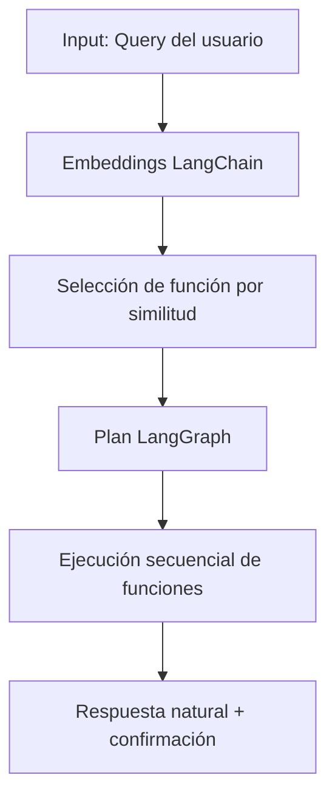

# Pipeline Transaccional con Neo4j y LLM

## Resumen
Sistema de consultas y pedidos en lenguaje natural sobre un grafo de conocimiento y datasets transaccionales, con selección de funciones por embeddings y respuesta en lenguaje humano.

## Stack de librerías y tecnologías usadas
- FastAPI
- Neo4j
- LangChain (embeddings)
- LangGraph (planificación)
- Sentence Transformers
- scikit-learn
- Google Gemini
- Pandas

## Flujo del proceso del agente (paso a paso)
1. El usuario ingresa una query.
2. Se generan embeddings del query con LangChain.
3. Se selecciona la función por similitud semántica.
4. Se crea un plan secuencial con LangGraph.
5. Se ejecutan funciones paso a paso (con logs).
6. Se responde en lenguaje natural y se confirma éxito/fallo.

## Diagrama del flujo usando Mermaid


## Explicación del diagrama
El sistema toma la query, genera embeddings, elige la función más adecuada, construye un plan secuencial y ejecuta cada paso con logs hasta producir una respuesta clara.

## Conclusiones
El proyecto implementa un flujo de agente verificable con embeddings, planificación y ejecución secuencial orientada a consultas y pedidos.

## Autores
- MLata

## Información de contacto
- Email: mlata@example.com

Sistema de consulta transaccional sobre un grafo de conocimiento con datos reales. El flujo principal es:

Query → Selection Function → Neo4j Execution → LLM Response

## Estructura del proyecto

```
final/
├── notebooks/
│   ├── pipeline_transaccional_neo4j.ipynb
│   └── kg_query_pipeline.ipynb
├── model/
│   └── funciones_sistema.py
├── api/
│   └── .gitkeep
├── front/
│   └── .gitkeep
├── data/
│   ├── olist/
│   │   └── (archivos Kaggle Olist)
│   ├── dataset_transaccional.csv
│   └── dataset_vendedores.csv
├── docs/
│   ├── INSTRUCCIONES_VISUALIZACION.md
│   ├── CELDA_VISUALIZACION.txt
│   └── preguntas_ejemplo.txt
├── scripts/
│   ├── test_sistema.py
│   └── download_kaggle_olist.py
├── .env.example
├── .env
└── README.md
```

## Descripción del flujo

1. Query del usuario
2. Generación de embedding de la consulta
3. Selección de función por similitud (Selection Function)
4. Ejecución de consulta en Neo4j (Planner)
5. Respuesta en lenguaje natural con Gemini

## Tabla de funciones

Las funciones del sistema están definidas en model/funciones_sistema.py con esta estructura:

- id
- nombre_funcion
- descripcion
- embedding
- query_examples

## Requisitos

- Python 3.8 o superior
- Neo4j corriendo en localhost:7687
- API Key de Google Gemini

## Configuración

1. Copiar el archivo .env.example a .env
2. Configurar credenciales de Neo4j y Google Gemini

Ejemplo de .env:

```
NEO4J_URI=bolt://localhost:7687
NEO4J_USER=neo4j
NEO4J_PASSWORD=tu_password

GOOGLE_API_KEY=tu_api_key
```

## Dataset Kaggle (recomendado)

Dataset seleccionado:

kartikeybartwal/ecomerce-product-recommendation-dataset

Descarga automática con KaggleHub desde el notebook.

Opcional: si no se puede descargar con KaggleHub, puedes usar Olist:

olistbr/brazilian-ecommerce

Para Olist:

1. Instala Kaggle CLI: pip install kaggle
2. Configura tus credenciales Kaggle (kaggle.json)
3. Ejecuta: python scripts/download_kaggle_olist.py

Si no hay datasets de Kaggle, se usa el dataset local en data/.

## Ejecución

1. Abrir notebooks/pipeline_transaccional_neo4j.ipynb
2. Ejecutar celdas en orden
3. Probar consultas como:
   - ¿Cuánto cuesta el iPhone 14?
   - ¿Quién vende laptops en Lima?
   - ¿Hay stock de audífonos Sony?

## Datos

Los datos reales se encuentran en data/:

- dataset_transaccional.csv (productos)
- dataset_vendedores.csv (vendedores)

## Notas

- La selección de función se muestra de forma explícita en la sección 7.1 del notebook.
- Si el modelo Gemini falla, el sistema devuelve un fallback con datos en JSON.# Pipeline Transaccional con Neo4j y LLM

Sistema de consulta transaccional sobre un grafo de conocimiento con datos reales. El flujo principal es:

Query → Selection Function → Neo4j Execution → LLM Response

## Estructura del proyecto

```
final/
├── notebooks/
│   └── pipeline_transaccional_neo4j.ipynb
├── model/
│   └── funciones_sistema.py
├── api/
│   └── .gitkeep
├── front/
│   └── .gitkeep
├── data/
│   ├── dataset_transaccional.csv
│   └── dataset_vendedores.csv
├── .env.example
├── .env
├── test_sistema.py
└── README.md
```

## Descripción del flujo

1. Query del usuario
2. Generación de embedding de la consulta
3. Selección de función por similitud (Selection Function)
4. Ejecución de consulta en Neo4j (Planner)
5. Respuesta en lenguaje natural con Gemini

## Tabla de funciones

Las funciones del sistema están definidas en model/funciones_sistema.py con esta estructura:

- id
- nombre_funcion
- descripcion
- embedding
- query_examples

## Requisitos

- Python 3.8 o superior
- Neo4j corriendo en localhost:7687
- API Key de Google Gemini

## Configuración

1. Copiar el archivo .env.example a .env
2. Configurar credenciales de Neo4j y Google Gemini

Ejemplo de .env:

```
NEO4J_URI=bolt://localhost:7687
NEO4J_USER=neo4j
NEO4J_PASSWORD=tu_password

GOOGLE_API_KEY=tu_api_key
```

## Ejecución

1. Abrir notebooks/pipeline_transaccional_neo4j.ipynb
2. Ejecutar celdas en orden
3. Probar consultas como:
   - ¿Cuánto cuesta el iPhone 14?
   - ¿Quién vende laptops en Lima?
   - ¿Hay stock de audífonos Sony?

## Datos

Los datos reales se encuentran en data/:

- dataset_transaccional.csv (productos)
- dataset_vendedores.csv (vendedores)

## Notas

- La selección de función se muestra de forma explícita en la sección 7.1 del notebook.
- Si el modelo Gemini falla, el sistema devuelve un fallback con datos en JSON.# Pipeline de Consulta sobre Grafo de Conocimiento (NLP + ML)

Sistema de consulta sobre grafos de conocimiento utilizando técnicas de Machine Learning, NLP y algoritmos de búsqueda en grafos.

## Descripción

Este proyecto implementa un pipeline completo que permite hacer consultas en lenguaje natural sobre un grafo de conocimiento y obtener respuestas razonadas siguiendo el flujo:

**Query → Selection Function → Planner**

### Características principales:

- **Procesamiento de lenguaje natural (NLP)** con spaCy
- **Embeddings semánticos** multilingües (español e inglés)
- **Extracción de entidades** (NER)
- **Búsqueda de caminos** en grafos (BFS, DFS, shortest path)
- **Visualización interactiva** con Plotly
- **Sistema de consultas múltiples**
- **Interfaz simple e intuitiva**

---

## Inicio Rápido

### Requisitos previos

- Python 3.8 o superior
- Jupyter Notebook o VS Code con extensión de Python

### Instalación

El notebook instala automáticamente todas las dependencias necesarias:

```python
# Dependencias principales
- networkx          # Operaciones con grafos
- numpy            # Computación numérica
- scikit-learn     # Métricas de similitud
- sentence-transformers  # Embeddings semánticos
- spacy            # NLP y NER
- plotly           # Visualización interactiva
- matplotlib       # Visualización estática
```

### Ejecución

1. Abre el archivo `kg_query_pipeline.ipynb` en Jupyter o VS Code
2. Ejecuta las celdas en orden (Shift + Enter)
3. El sistema descargará automáticamente los modelos necesarios

---

## Guía de Uso

### Opción 1: Consulta Interactiva

Ejecuta la celda de "Consultas Interactivas" (Celda 9):

```python
# El sistema te mostrará preguntas de ejemplo
# Puedes elegir un número (1-7) o escribir tu propia consulta

Tu consulta: ¿Qué tecnologías utiliza Tesla?
```

### Opción 2: Usar la función `run_pipeline`

```python
# Ejecutar una consulta personalizada
results = run_pipeline(
    query="¿Qué empresas fundó Elon Musk?",
    top_k=3,          # Número de entidades más relevantes
    max_depth=4,      # Profundidad máxima de búsqueda
    show_viz=True     # Mostrar visualización del grafo
)
```

### Opción 3: Consultas en Batch

Ejecuta la celda 11 para procesar múltiples consultas:

```python
consultas_batch = [
    "¿Qué tecnologías utiliza Tesla?",
    "¿Qué empresas dirige Elon Musk?",
    "¿Qué relación hay entre el Cibertruck y la batería?",
]
```

---

## Ejemplos de Preguntas

Consulta el archivo `preguntas_ejemplo.txt` para ver más de 40 preguntas organizadas por categorías:

### Categorías disponibles:

1. **Relaciones entre personas y empresas**
   - ¿Qué empresas dirige Elon Musk?
   - ¿Cuál es la relación entre Elon Musk y Tesla?

2. **Tecnologías y productos de Tesla**
   - ¿Qué tecnologías utiliza Tesla?
   - ¿Qué producto de Tesla usa batería?

3. **Tecnologías e Inteligencia Artificial**
   - ¿Qué tecnología usa el Autopilot?
   - ¿Tesla usa inteligencia artificial?

4. **SpaceX y sus productos**
   - ¿Qué relación hay entre SpaceX y Starlink?
   - ¿SpaceX realiza lanzamientos?

5. **Mercado y ubicación**
   - ¿Dónde está ubicada Tesla?
   - ¿En qué mercado compite Tesla?

6. **Energía y almacenamiento**
   - ¿Qué relación hay entre Tesla y las baterías?
   - ¿Tesla invierte en energía solar?

7. **Preguntas complejas**
   - ¿Cómo está relacionado Elon Musk con la inteligencia artificial?
   - ¿Qué conexión hay entre SpaceX y Estados Unidos?

---

## Cómo Funciona el Pipeline

### Etapa 1: Query Processing
- **Tokenización**: Divide la consulta en tokens
- **NER**: Extrae entidades mencionadas
- **Embedding**: Genera representación vectorial semántica

### Etapa 2: Selection Function
- **Matching**: Compara embedding de la consulta con nodos del grafo
- **Similitud**: Calcula similitud coseno
- **Ranking**: Selecciona entidades más relevantes (top-k)

### Etapa 3: Planner
- **BFS**: Búsqueda en anchura para encontrar caminos
- **DFS**: Búsqueda en profundidad
- **Shortest Path**: Calcula camino más corto
- **Scoring**: Asigna puntajes a los caminos encontrados

### Etapa 4: Response Generation
- **Interpretación**: Traduce caminos a lenguaje natural
- **Explicación**: Genera respuesta razonada
- **Visualización**: Muestra grafo con caminos resaltados

---

## Visualización Interactiva

El grafo interactivo incluye:

- **Nodos rojos**: Entidades más relevantes para la consulta
- **Nodos grises**: Otras entidades del grafo
- **Aristas azules gruesas**: Caminos encontrados por el Planner
- **Aristas grises**: Otras relaciones
- **Hover**: Pasa el mouse para ver detalles de nodos y relaciones
- **Zoom/Pan**: Navega libremente por el grafo

---

## Personalización del Grafo

### Agregar nuevos nodos

Edita la Celda 5 (Load and Build Knowledge Graph):

```python
nodes["Nuevo Nodo"] = {
    "type": "Tipo",
    "description": "Descripción detallada del nodo"
}
```

### Agregar nuevas relaciones

```python
edges.append((
    "Origen",
    "Destino",
    {
        "relation": "nombre_relacion",
        "description": "Descripción de la relación"
    }
))
```

### Re-ejecutar

Después de modificar el grafo, re-ejecuta las celdas desde la Celda 5 en adelante.

---

## Estructura del Notebook

| Celda | Sección | Descripción |
|-------|---------|-------------|
| 1-2 | Introducción | Documentación y descripción |
| 3 | Imports | Instalación y carga de dependencias |
| 5 | Grafo | Construcción del grafo de conocimiento |
| 7 | Query Processing | Procesamiento NLP de consultas |
| 9 | Selection Function | Matching de entidades relevantes |
| 11 | Ranking | Cálculo de similitud y ranking |
| 13 | Planner | Búsqueda de caminos (BFS/DFS) |
| 15 | Response Gen | Generación de respuestas |
| 17 | Pipeline | Función completa end-to-end |
| 19 | Consultas | Sistema de consultas interactivas |
| 21 | Visualización | Grafo interactivo con Plotly |
| 23 | Batch | Procesamiento de múltiples consultas |

---

## Parámetros Configurables

### `run_pipeline()`

```python
results = run_pipeline(
    query="Tu consulta aquí",     # Consulta en lenguaje natural
    top_k=3,                       # Número de entidades top (1-10)
    max_depth=4,                   # Profundidad máxima de búsqueda (1-10)
    show_viz=False                 # Mostrar visualización (True/False)
)
```

**Recomendaciones:**
- `top_k=3`: Bueno para consultas específicas
- `top_k=5-7`: Mejor para consultas exploratorias
- `max_depth=3-4`: Caminos directos
- `max_depth=5-6`: Permite relaciones más complejas

---

## Soporte Multilingüe

El sistema está configurado para **español** por defecto, pero soporta múltiples idiomas:

### Modelo NLP actual:
- `es_core_web_sm` (español)

### Modelo de embeddings:
- `paraphrase-multilingual-MiniLM-L12-v2` (multilingüe)

### Cambiar a otro idioma:

Modifica la Celda 3:

```python
# Para inglés
nlp = spacy.load("en_core_web_sm")

# Para francés
nlp = spacy.load("fr_core_news_sm")
```

---

**Creado con:** Python, NetworkX, spaCy, Sentence-Transformers, Plotly  
**Fecha:** Enero 2026  
**Versión:** 1.0
